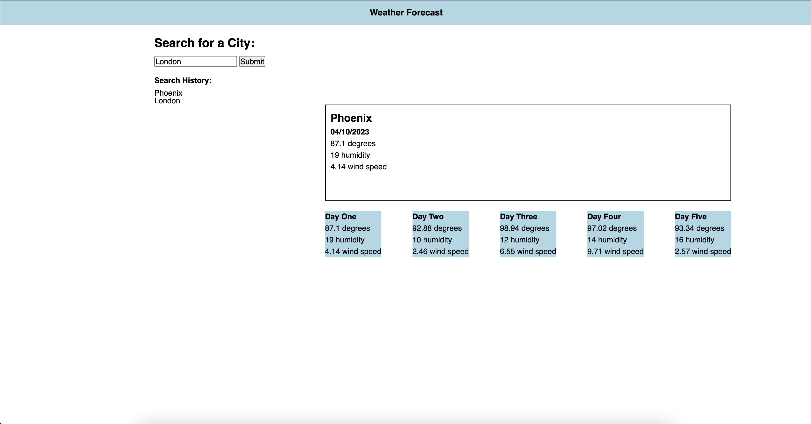

# weather-forecast

## Description

This weather forecast application lets a user input their city and see the current and future forecast.

## Installation

There is no need to install. Just follow this link 
https://raythomass.github.io/weather-forecast/

## Usage

Provide instructions and examples for use. Include screenshots as needed.

To add a screenshot, create an `assets/images` folder in your repository and upload your screenshot to it. Then, using the relative filepath, add it to your README using the following syntax:

    ```md
    
    ```

